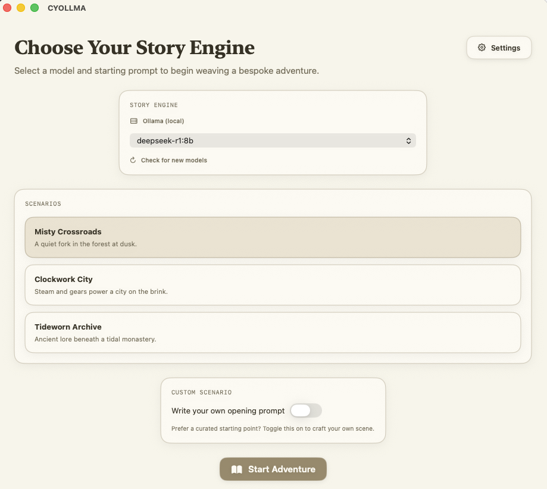
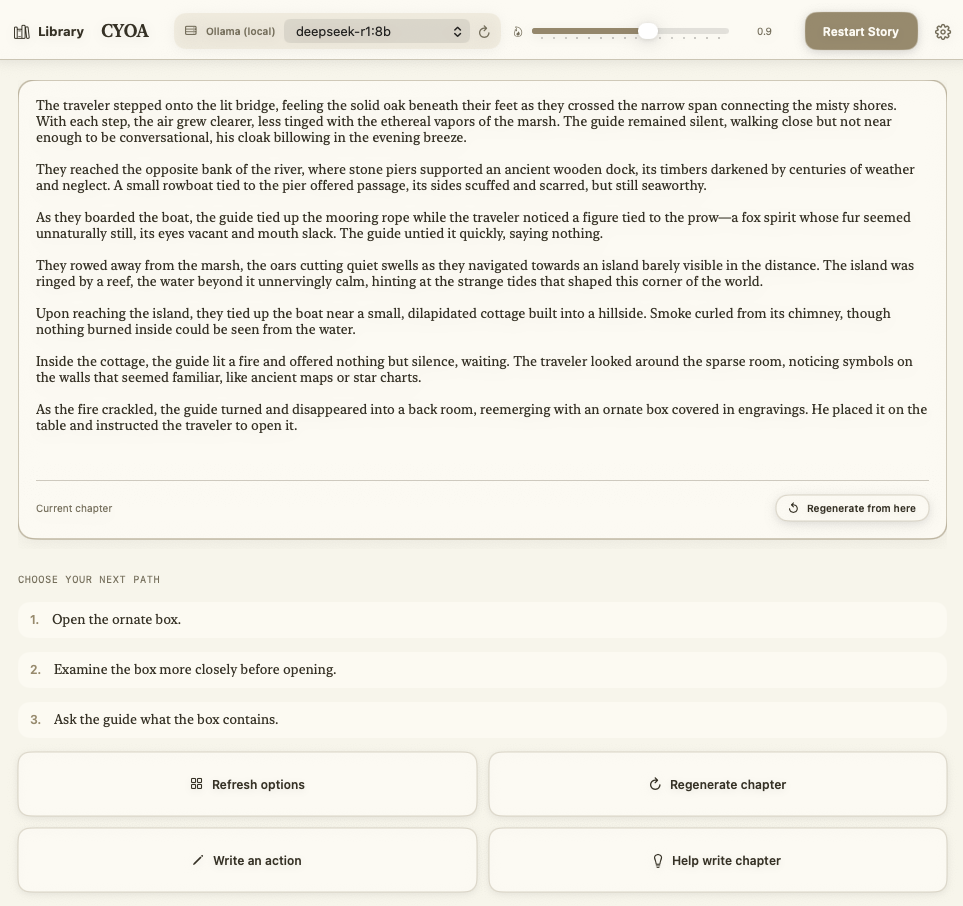

# CYOLLMA

CYOLLMA is a macOS SwiftUI app for running choose‑your‑own‑adventure sessions against local Ollama models or Groq's hosted LLMs. It guides the model with strict prompts to keep chapters fresh, collects player choices, and lets you steer the story with write‑ins or explicit creative direction.

## Download

  

**For Apple Silicon (M1/M2/M3) Macs**

**Note:** Right-click the app and select "Open" the first time you launch it, as macOS may show a security warning for unsigned apps. For easier distribution, consider zipping the app bundle or hosting it via GitHub Releases.

## Features

- **Model switching** – Flip between local Ollama models and Groq’s cloud models from the in‑app settings modal.
- **Chapter management** – Tracks the active playthrough, supports regenerating chapters or just refreshing the choice list.
- **Creative direction** – Queue bespoke guidance that’s woven into the next generated chapter.
- **Narration (Groq)** – Generate text‑to‑speech narration for any chapter using Groq’s `playai-tts`, with playback speed control.

## Getting Started

1. Install dependencies:
   - Ollama with at least one compatible model installed if you want to run locally.
   - A Groq API key if you plan to use Groq models or narration.
2. Open `CYOLLMA.xcodeproj` in Xcode 15 or newer.
3. Build and run the `CYOLLMA` scheme.
4. From the home screen, open **Settings** to select your provider and model, then pick or author a starting scenario.

## Screenshots

  
  
  

## License

This project is provided as‑is; add licensing details here if you plan to distribute it.
